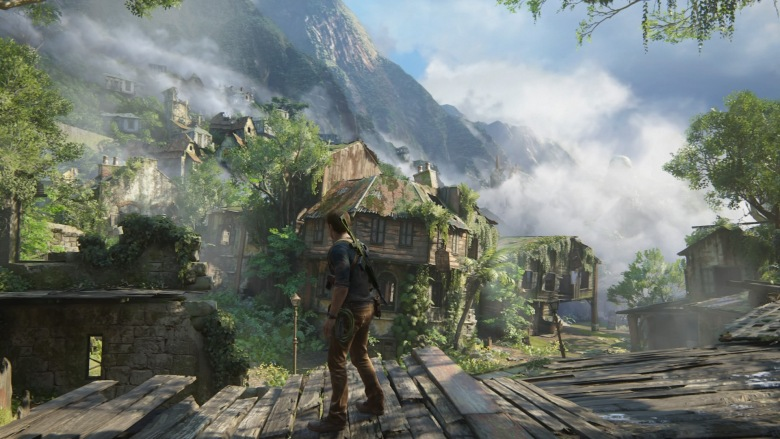

# PBR

## 설명

PBR은 Physical Based Rendering의 약자로 물리 기반 렌더링을 의미합니다. PBR은 디즈니가 연구를 하였고 에픽 게임즈가 게임에 적용을 하면서 대부분의 게임에 사용되게 되었습니다. PBR과 IBL을 동시에 사용하면 아래 그림과 같은 실사와 같은 수준의 렌더링을 할 수 있습니다.



PBR을 설명하기 전에 PBR이 나온 배경을 알아보겠습니다. PBR을 사용하기 전에는 퐁 셰이딩이 사용됬습니다. 아티스트들은 퐁 셰이딩을 이용해서 실사를 구현하려고 노력했지만 제대로 표현할 수 없었습니다. 왜 표현할 수 없는지 이유를 찾다보니 퐁 셰이딩이 물리 법칙들을 위반했다는 사실을 발견했고 물리 법칙을 따르는 PBR이 탄생하였습니다. 한가지 알고 넘어가셔야하는 것은 PBR도 물리 법칙을 정확히 따르지 않습니다. 물리 법칙을 정확하게 따른다면 물리 기반 렌더링이 아닌 물리 렌더링이 되었을 것입니다.

PBR은 아래의 두 가지의 법칙을 따릅니다.

1. 미세면 표면 모델을 기반으로 합니다.
2. 에너지 보존 법칙을 지킵니다.

### 미세면


PBR에서는 위의 그림처럼 물체의 표면이 매우 작은 면들로 구성되어 있다고 생각합니다. 거칠수록 울퉁불퉁하고 매끄러울수록 평평합니다.


울퉁불퉁하거나 평평한 면과 빛이 부딪히면 위의 그림처럼 빛이 산란되게 됩니다. 거친 평면에 반사된 빛은 이리저리 반사되고 평평한 평면에 반사된 빛은 어느정도 일정한 방향으로 반사됩니다. PBR에선 미세면을 roughness를 통해 정의하고 roughness를 이용하여 미세면이 노말 벡터나 하프웨이 벡터와 얼만큼 정렬되어있는지 계산할 수 있습니다.

### 에너지 보존 법칙

빛이 물체의 표면에 부딪히면 아래 그림과 같은 현상이 발생하게 됩니다.


빛의 일부는 반사되고 일부는 흡수됬다가 다시 밖으로 나오게 됩니다. 에너지 보존 법칙에 의해서 반사되는 빛의 양과 흡수됬다가 다시 나오는 빛의 양이 들어오는 빛의 양을 초과할 수 없습니다. 여기서 반사되는 빛은 스펙큘러이고 흡수됬다가 다시 나오는 빛은 디퓨즈입니다. 그러므로 이 법칙에 기반해서 아래와 코드와 같이 스펙큘러와 디퓨즈에 가중치를 둬야합니다.

```
float kS = calculateSpecularFactor(...);
float kD = 1.0 - kS;
```

퐁 셰이딩은 이러한 에너지 보존법칙을 고려하지 않았기 때문에 실사와 같은 렌더링을 할 수 없었던 것입니다.

### BRDF

마크다운을 이용해서 수식을 표현하기 어렵기 때문에 BRDF에 대해서는 설명을 하지 않고 구현을 참조할 수 있는 링크만 남깁니다.

* [언리얼 엔진의 PBR](https://blog.selfshadow.com/publications/s2013-shading-course/karis/s2013_pbs_epic_notes_v2.pdf)
* [쉐이딩을 위한 물리와 수학](https://blog.selfshadow.com/publications/s2013-shading-course/hoffman/s2013_pbs_physics_math_notes.pdf)
* [오픈 지엘을 이용한 PBR 구현](https://learnopengl.com/PBR/Lighting)

## 구현

* [다이렉트 엑스](https://github.com/daemyung/graphics/tree/master/pbr/d3d)
