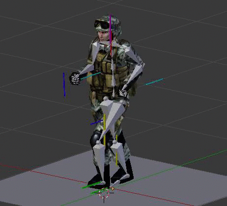
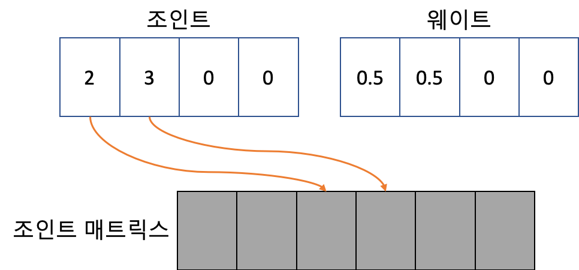
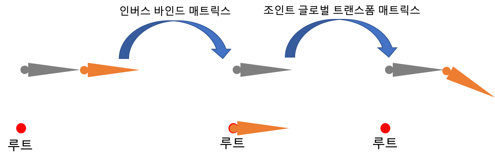
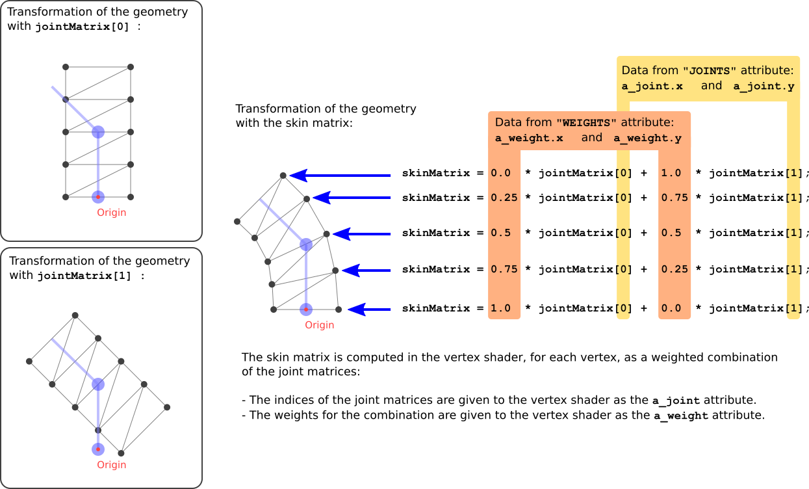

# 스키닝

## 설명

*스키닝을 설명하기 위해 GLTF를 사용합니다. GLTF보다 유명한 다른 모델 포맷들도 있지만 GLTF가 크로노스에 의해 정의된 표준이기 때문에 GLTF를 사용합니다. 다른 포맷들도 비슷하기 때문에 GLTF를 이용해서 스키닝을 이해하시면 다른 포맷들도 쉽게 구현할 수 있습니다.*


스키닝을 이용하면 위의 그림과 같이 매쉬에 생동감을 줄 수 있습니다. 정적인 물체를 움직일 수 있기 때문에 굉장히 멋있지만 스키닝을 이해하고 구현하는 것은 상당히 어렵습니다. 이번 예제에서는 [가장 기본적인 모델](https://github.com/KhronosGroup/glTF-Sample-Models/tree/master/2.0/SimpleSkin)을 이용해서 스키닝을 이해하고 구현하도록 하겠습니다.

### 스켈레톤 구조



매쉬의 움직임은 스켈레톤 구조를 통해 정의됩니다. 위의 그림에서 회색으로 렌더링되는 도형을 조인트라고 합니다. 위의 그림처럼 조인트가 움직임에 따라 매쉬도 따라 움직이게 됩니다. 정리하면 스켈레톤 구조는 조인트로 이루어져 있고 조인트의 움직임에 따라 매쉬도 움직이게 됩니다.

예제에서 사용되는 모델은 아래 코드와 같이 두 개의 조인트를 가지고 있습니다. 조인트도 일종의 노드로써 부모, 자식관계를 가질 수 있습니다. 조인트라고 불리는데는 이유가 있습니다. 그 이유는 바로 조인트가 뼈와 뼈 사이의 관절 역활을 하기 때문입니다.

```json
"nodes" : [ {
...}, {
  "children" : [ 2 ],
  "translation" : [ 0.0, 1.0, 0.0 ]
}, {
  "rotation" : [ 0.0, 0.0, 0.0, 1.0 ]
} ],
```

첫 번째 조인트는 트랜스레이션 프로퍼티를 가지고 있으며 Y축으로 +1만큼 이동시켜줍니다. 두 번째 조인트는 로테이션 프로퍼티를 가지고 있으나 회전하지는 않습니다. 나중에 애니메이션에 의해서 이 값들이 변경되고 위의 그림처럼 매쉬가 움직이게 됩니다.

### 스킨

스킨은 스키닝의 핵심적인 요소입니다. GLTF에서 스킨은 스켈레톤 구조를 정의한다고 볼 수 있습니다. 스킨은 인버스 바인드 매트릭스와 조인트들로 구성되어 있습니다. 예제에서 사용되는 모델은 아래 코드와 같이 한 개의 스킨으로 구성되어 있습니다.

```json
"skins" : [ {
  "inverseBindMatrices" : 4,
  "joints" : [ 1, 2 ]
} ],
```

인버스 바인드 매트릭스는 애니메이션에 의해서 조인트의 위치, 회전, 스케일이 변경될 때 매쉬을 올바르게 변경되기 위해서 사용됩니다. 인버스 바인드 매트릭스의 필요성이 이해가 잘 되지 않는다면 매쉬을 특정 위치를 기준으로 회전하는 경우를 생각해보시면 됩니다. 매쉬을 올바르게 회전시키기 위해선 먼저 매쉬을 특정 위치로 옮기고 나서 회전시켜야 합니다. 즉 인버스 바인드 매트릭스는 매쉬에 조인트의 위치, 회전, 스케일을 적용하기 전에 스킨의 루트로 이동시키는 매트릭스입니다. 예제의 스킨은 아래와 같은 인버스 바인드 매트릭스를 가지고 있습니다.

```
1.0   0.0   0.0    0.0   
0.0   1.0   0.0   -1.0   
0.0   0.0   1.0    0.0   
0.0   0.0   0.0    1.0  
```

위의 인버스 바인드 매트릭스를 매쉬를 Y축으로 -1만큼 이동시켜줍니다.


위의 그림은 매쉬에 인버스 바인드 매트릭스를 곱했을 때 매쉬가 이동되는것을 보여줍니다. 인버스 바인드 매트릭스를 곱한 결과가 이상하게 보일 수 있습니다. 매쉬에 스킨을 적용하지 않은 중간 결과이기 때문에 이상하게 보이는 것은 당연합니다. 반드시 알고 넘어가셔야하는 것은 인버스 바인드 매트릭스는 매쉬에 조인트를 올바르게 적용하기 위해 사용되는 매트릭스라는 것입니다.


### 조인트 매트릭스 팔레트

매쉬가 조인트에 의해서 움직이기 위해서 버텍스에 조인트와 웨이트가 주어집니다. 아래 그림처럼 조인트는 4개의 인덱스와 웨이트 4개로 구성되어 있는데 이를 조인트 매트릭스 팔레트라고 합니다.



위의 그림에서 알 수 있듯이 조인트 값은 조인트 매트릭스의 인덱스입니다. 웨이트 값에 의해 2 번째 조인트 매트릭스가 50% 적용되고 3번째 조인트 매트릭스가 50%만큼 적용되는것을 알 수 있습니다. 이렇게 계산된 매트릭스를 스킨 매트릭스라고 부릅니다. 일반적으로 이러한 계산은 버택스 셰이더에서 처리되는데 아래 코드와 같이 작성될 수 있습니다.

```glsl
uniform mat joint_matices[64];

void main() {
    mat4 skin_matrix = weight.x * joint_matrix[joint.x] +
                       weight.y * joint_matrix[joint.y] +
                       weight.z * joint_matrix[joint.z] +
                       weight.w * joint_matrix[joint.w];

}

```

조인트 매트릭스는 아래의 3개의 매트릭스의 곱으로 계산될 수 있습니다.

* 매쉬의 노드의 글로벌 트랜스폼 매트릭스의 역행렬.
* 조인트 노드의 글로벌 트랜스폼 매트릭스.
* 조인트의 인버스 바인드 매트릭스.

조인트 매트릭스의 계산을 아래 코드와 같이 작성될 수 있습니다.

```cpp
for (auto i = 0; i != joint_count; ++i) {
    joint_matrix[i] = inverse_node_global_transform_matrix *
                      joint_global_transform_matrix[i] *
                      inverse_bind_matrix[i];
}
```

조인트 매트릭스를 통해 아래 그림과 같은 결과를 얻을 수 있습니다.



모든 정보를 조합하면 최종적인 버텍스 셰이더는 아래 코드와 같이 작성될 수 있습니다.

```glsl
uniform mat joint_matices[64];

void main() {
    mat4 skin_matrix = weight.x * joint_matrix[joint.x] +
                       weight.y * joint_matrix[joint.y] +
                       weight.z * joint_matrix[joint.z] +
                       weight.w * joint_matrix[joint.w];

    gl_Position = projection_matrix * view_matrix * model_matrix *
                  skin_matrix * position;
}

```

이러한 계산은 아래 그림에서 자세하게 설명하고 있습니다.



모든것이 올바르게 계산됬다면 아래와 같이 매쉬가 움직이는 것을 확인할 수 있습니다.


## 구현

* [메탈](https://github.com/daemyung/graphics/tree/master/skinning/mtl)